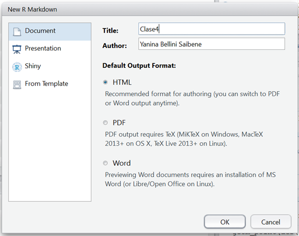

## Presentación

La presentación de la primera lección se encuentran aqui: https://docs.google.com/presentation/d/1nUJGAnr7iudZSUNDJBq-ddpzRbe6zaZIQzFr8SXrHH8/edit?usp=sharing 

## Rmarkdown

Si en tu trabajo tenes que presentar informes o resultados de tu análisis de datos, tal vez te hayas encontrando usando más de un software, por ejemplo Word para el texto y Excel para los gráficos.  Tal vez has tenido que guardar más de vez gráficos y tablas y hayas copiado resultados de un archivo al otro hasta que el informe quedó como querías. 

Rmarkdown tiene como filosofía un solo formato, varias salidas. Esto significa que escribiendo en un solo formato podemos tener varias salidas como Words, PDF, HTMLs, entre varios otros.

Además, un archivo de R Markdown (generalmente con la extensión _.Rmd_), a diferencia de un script _.R_, es un archivo de texto plano que combina código de R que genera resultados (gráficos, tablas, etc…) y el texto que lo describe. Al poder intercalar cálculos y gráficos con su análisis o explicación, se unifica el flujo de trabajo y deja de ser necesario guardar figuras o tablas para luego insertarlas en un documento de texto. Esto es muy importante si buscamos que nuestro trabajo sea reproducible, pero además ahorra tiempo.

## Creando archivos .Rmd

En RStudio se puede crear un nuevo archivo de R Markdown con el menú desplegable:

> File → New File → R Markdown

Y se abrirá un menú donde se puede agregar el título del informe y el nombre del/la autor/a.
Por ahora vamos a usar el formato HTML como salida, pero más adelante veremos los otros formatos de salida posibles.

Al aceptar, se abrirá un nuevo archivo con una plantilla de ejemplo (en inglés).

Para generar el archivo de salida, el paquete **knitr** (que viene de *tejer* en inglés) ejecutará el código en una sesión independiente de R e interpretará el texto, su formato y cualquier otra cosa que agreguemos (por ejemplo imágenes o links externos).
Esto significa que nuestro archivo debe tener **todo** lo necesario para generar el análisis (datos cargados, paquetes instalados, calculos realizados en el orden correspondiente, entre otras cosas) y si nos olvidamos de algo va a dar error.

Por esta razón es recomendable *knitear* el archivo seguido, para encontrarnos con los errores a tiempo y de paso asegurarnos que el análisis es reproducible.

> Vamos a generar la salida HTML de la plantilla de RStudio, obtené el archivo de salida en formato HTML haciendo click en el botón **knit** (el que tiene un ovillo de lana y un par de agujas!).

## Estructura de un .Rmd

Cualquier archivo de este tipo tiene 3 partes principales:  El encabezado o YAML, el texto (con fondo blanco) y los _chunks_ de código con fondo gris.  Veamos las características del texto. 

### El texto propio del documento.

Este es el texto dirigido a las personas que van a leer el reporte.
Incluirá una introducción, descripción de los datos y de los resultados; es lo que escribirías en el archivo de Word.

A diferencia de Word, el formato del texto se define usando [markdown](<https://es.wikipedia.org/wiki/Markdown>), que es un lenguaje simple que permite indicar si un texto va en negrita, cursiva, es un título, etc...usando símbolos especiales dentro del texto.

## Markdown

Markdown permite escribir en texto plano pero definiendo el formato usando símbolos.
Por ejemplo podés resaltar con **negrita** usando dos asteriscos así: `**negrita**` o *italizada* con un asterisco de cada lado: `*itálicas*`.

También podés hacer una lista de elementos utilizando asteriscos:

    * la negrita se consigue con dos asteriscos
    * la italizada con un asterisco
    * y para resaltar código se usa el acento grave `

o guiones medios:

    - la negrita se consigue con dos asteriscos
    - la italizada con un asterisco
    - y para resaltar código se usa el acento grave `

Ambas listas se van a ver de esta manera:

-   la negrita se consigue con dos asteriscos
-   la italizada con un asterisco
-   y para resaltar código se usa el acento grave \`

Si en realidad querés una lista numerada, simplemente comenzá el renglón un número y un punto.
Podrías usar siempre el mismo número, markdown se encarga del resto:

    1. la negrita se consigue con dos asteriscos
    1. la italizada con un asterisco
    1. y para resaltar código se usa el acento grave `

Ahora la lista numerada se ve así:

1.  la negrita se consigue con dos asteriscos
2.  la italizada con un asterisco
3.  y para resaltar código se usa el acento grave \`

Podés agregar títulos con distinta jerarquía agregando `#` al comienzo.
Esto además define secciones dentro del documento:

    # Título
    ## El primer subtítulo
    ### Otro subtítulo de menor jerarquía
    #### Otro más, y podría seguir!

Podés escribir estos símbolos a mano o usando el Editor Visual de RStudio (sólo disponible para la versión 1.4 en adelante) haciendo click en el ícono de compás que está a la derecha del documento () . 
El Editor Visual permite dar formato al texto usando markdown sin saber usar markdown.

> Agregale texto a tu archivo: Borrá el contenido del archivo `.Rmd` que creaste (pero no el encabezado!) y probá escribir algo y darle formato.
Luego volvé a apretar el botón **knit** para ver el resultado.

Markdown permite muchas otras cosas, por ejemplo:

Podés agregar un link a una página externa: `[texto que se muestra con el link](http://google.com)`. 
Resultado: [texto que se muestra con el link](http://google.com)

Podés incluir una imagen: ``: Resultado: 

Y también podés agregar ecuaciones (usando [LaTeX](https://es.wikipedia.org/wiki/LaTeX)) en la misma línea (esto:`$E = mc^2$` se ve así: $E = mc^2$) o en una línea propia.
Esto:

    $$
    y = \mu + \sum_{i=1}^p \beta_i x_i + \epsilon
    $$

se ve así:

$$
y = \mu + \sum_{i=1}^p \beta_i x_i + \epsilon
$$

> Se puede revisar la guía rápida de Markdown desde RStudio (en inglés): _Help → Markdown Quick Reference_
