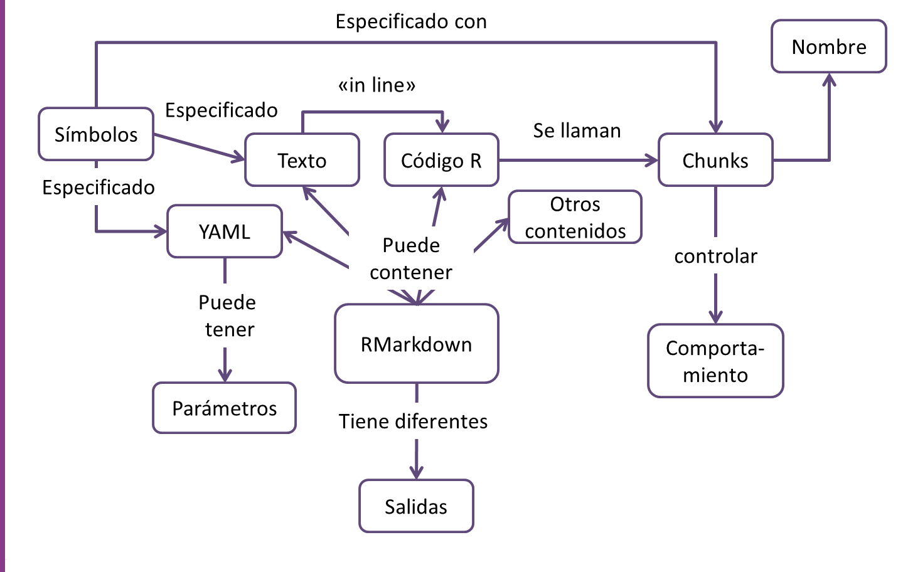

## ¿Para quien está pensado ente taller?

Aqui te presentamos las personas tipo de este meetup.

_Antonia_ es contadora y trabaja en un banco. Es joven (entre 30-45 años). Trabaja con muchas fuentes de datos diferentes y tiene mucha experiencia usando Excel y Word; sabe algo de SQL básico. Necesita poder unir y analizar estas diversas fuentes de datos y generar informes para su equipo y sus jefes. Nunca usó R. No puede ir al taller en el horario de trabajo (7.00 a.m. a 13.00 p.m.), y es madre, por lo que debe terminar antes de que los niños salgan de la escuela. En su trabajo está muy ocupada y es muy demandada, por lo que un taller intensivo fuera de su lugar de trabajo es la mejor opción para Antonia.

_Facundo_ está iniciando su carrera de investigador. Debe hacer informes que incluyan estadísticas como parte de sus actividades en su universidad. Usa Excel e InfoStat (un programa de estadísticas basado en menús) para registrar sus datos y realizar sus cálculos; y luego utiliza Word para escribir sus informes copiando y pegando desde los otros softwares. Ha oído hablar de las herramientas que tiene R y está interesado en aprender a usarlas. Solo usó R a través de Rcomander, que aprendió en un curso sobre estadísticas.


## Objetivo 

Introducir a las personas que asistan a RMarkdown para realizar informes.

## Contenido

1. ¿Qué es RMarkdown (Rmd)?

2. Ejemplo de uso

3. Partes de un Archivo .Rmd

4. Chunks de código y como configurarlos

5. Tipos de salida, templates, paquetes.

6. Parametrización

## Mapa conceptual del taller completo



## Requisitos previos

### R y RStudio

Asumimos que tenes instalado R y RStudio, si no es así [seguí estas intrucciones](https://dnme-minturdep.github.io/DT6_ciencia_de_datos_turismo/instalando-r-y-rstudio.html).

### Paquetes

Instalar los paquetes {rmarkdown} y {knitr}.

```{r eval=FALSE}

install.packages("rmarkdown")
install.packages("knitr")

```


## ¿Quién soy? 

**Yanina Bellini Saibene**


Yanina Bellini Saibene, MSc. Lic. Es investigadora titular en el Instituto Nacional de Tecnología Agropecuaria (INTA, Argentina). Aplica sus conocimientos de informática y ciencia de datos para llevar los desarrollos tecnológicos a las regiones rurales de Argentina. Coordina la Red Nacional de Modelización de Agroecosistemas en el INTA. También desarrolla software para apoyar la investigación y la educación. Es profesora de grado y posgrado en varias universidades de Argentina y Uruguay, enseñando Ciencia de Datos aplicada y desarrollando cursos abiertos y tutoriales para enseñar habilidades técnicas en el manejo de datos. Es trainer e instructora de [The Carpentries](https://carpentries.org/) e instructora certificada de [RStudio](https://education.rstudio.com/trainers/people/bellini_saibene+yanina/). Tambiés es miembro del Executive Council de The Carpentries y Conferences Team Lead de [Forwards](https://forwards.github.io/). Es cofundadora y miembro del Core-Team de [MetaDocencia](http://metadocencia.org/). Forma parte del equipo de [R-Ladies Global](https://rladies.org/), preside varias conferencias internacionales (useR! 2021, LatinR, JAIIO) y es conferencista internacional. También lidera y participa en la traducción comunitaria de material educativo y técnico al español, como [Teaching Tech Together](https://teachtogether.tech/es/index.html), [R4DS](https://es.r4ds.hadley.nz/) y lecciones de The Carpentries. 

[yabellini.netlify.com](https://yabellini.netlify.com/)
[\@yabellini](https://twitter.com/yabellini)


## Licencia

<a rel="license" href="https://creativecommons.org/licenses/by-sa/4.0/deed.es_ES"></a><br />
Todo el material de este curso está bajo la licencia <a rel="license" href="https://creativecommons.org/licenses/by-sa/4.0/deed.es_ES">Creative Commons Attribution-ShareAlike 4.0 International License</a>.

El código fuente de estos materiales y la página web pueden encontrarse en https://github.com/yabellini/GEE_course_code.


## ¿Dónde se dictó este taller?

Este taller ya se dictó en el marco de PampaSeg 2019 y R-Ladies Santa Rosa meetup.
